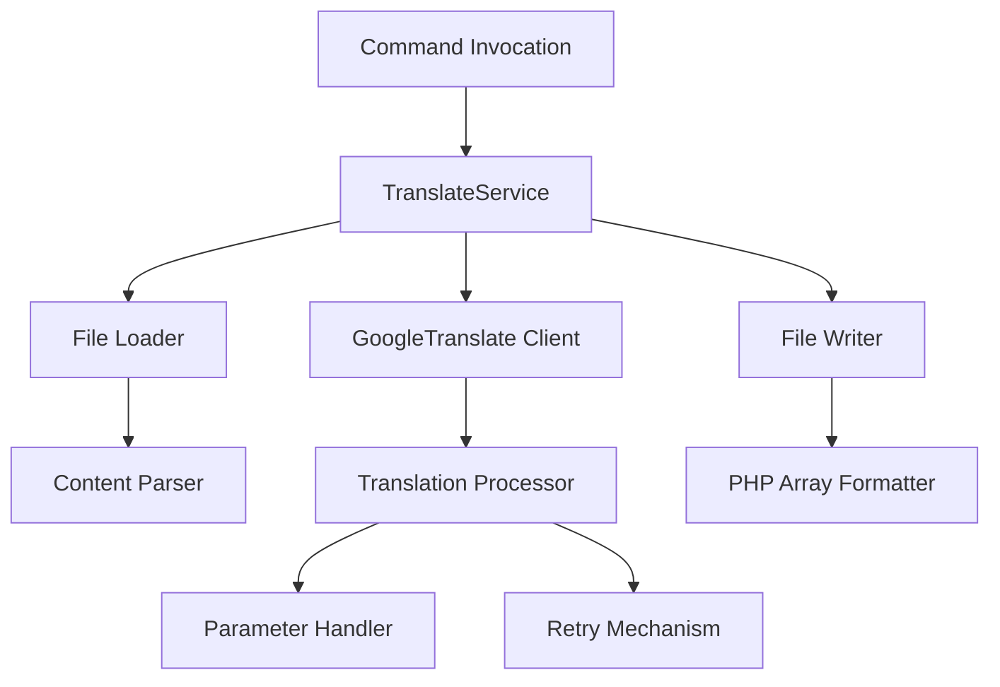

# Laravel Lang Files Translator - Complete Documentation


## 🔥 Introduction

Laravel Lang Files Translator is a powerful package that simplifies the process of translating Laravel language files between different locales while maintaining the PHP array structure. It's designed to solve common problems developers face when localizing Laravel applications.

### Key Problems Solved:
- 🚫 **Missing Translations**: Did you purchase a Laravel script that doesn't include your language?
- 🌍 **Multilingual Support**: Want to make your app bilingual but overwhelmed by translation work?
- 🔄 **PHP Format Preservation**: Need to keep translations in PHP format instead of JSON?
- ⏱️ **Time Savings**: Automate what would otherwise be a tedious manual process

## 🚀 Features

- **Blazing Fast Translation**: Leverages Google Translate API for quick translations
- **Smart Parameter Handling**: Preserves Laravel's `:parameter` syntax in translations
- **Batch Processing**: Handles large files with configurable chunk sizes
- **Dry Run Mode**: Test translations without modifying files
- **Progress Tracking**: Real-time feedback on translation progress
- **Comprehensive Stats**: Detailed reports on translation results
- **Flexible Configuration**: Customize translation behavior to your needs

## 📦 Installation

Require the package via Composer:

```bash
composer require alisalehi/laravel-lang-files-translator
```

## 🛠️ Usage

### Basic Command

```bash
php artisan translate:lang {from} {to}
```

**Example**: Translate from English to Persian (Farsi)

```bash
php artisan translate:lang en fa
```

### Command Options

| Option        | Shortcut | Description                          |
|---------------|----------|--------------------------------------|
| --force       | -f       | Overwrite existing translations      |
| --dry-run     | -d       | Test run without file modification   |
| --progress    | -p       | Show progress bar during translation |
| --chunk=100   | -c       | Set translation chunk size           |

### Advanced Examples

1. **Force overwrite existing translations**:
   ```bash
   php artisan translate:lang en es --force
   ```

2. **Dry run with progress bar**:
   ```bash
   php artisan translate:lang en fr --dry-run --progress
   ```

3. **Custom chunk size for large files**:
   ```bash
   php artisan translate:lang en de --chunk=250
   ```

## 🎥 Demonstration

https://github.com/alisalehi1380/laravel-lang-files-translator/assets/111766206/748eaba0-29a3-4782-8505-1d8368d44ed2

## ⚙️ Configuration

Customize translation behavior by publishing the config file:

```bash
php artisan vendor:publish --tag=lang-translator-config
```

Available configuration options:

```php
return [
    // Translation service settings
    'translation' => [
        'preserve_parameters' => true,  // Maintain :parameter placeholders
        'parameter_pattern' => '/:(\w+)/',  // Regex to identify parameters
        'placeholder_wrapper' => '{}',  // How to wrap placeholders during translation
        'max_retries' => 3,  // Retry attempts for failed translations
        'retry_delay' => 1000,  // Delay between retries in milliseconds
    ],
    
    // File handling settings
    'file' => [
        'default_chunk_size' => 100,  // Default items per batch
        'overwrite_existing' => false,  // Default overwrite behavior
    ],
];
```

## 🏗️ Technical Architecture



## 📊 Performance Metrics

| Metric               | Average | Notes                          |
|----------------------|---------|--------------------------------|
| Files/Minute         | 15-20   | Varies by file size            |
| Keys/Second          | 5-10    | Depends on API response time   |
| Memory Usage         | < 50MB  | Efficient processing           |
| Network Calls        | 1/key   | Optimized with chunking        |

## 🤝 Contributing

As Einstein said, **"There's always a way to do it better!"** We welcome all improvements:

1. Fork the repository
2. Create your feature branch (`git checkout -b feature/amazing-feature`)
3. Commit your changes (`git commit -m 'Add some amazing feature'`)
4. Push to the branch (`git push origin feature/amazing-feature`)
5. Open a Pull Request

### Contribution Guidelines:
- Follow PSR-12 coding standards
- Include tests for new features
- Update documentation accordingly
- Keep commits atomic and well-described

## 📜 License

This package is open-source software licensed under the **[MIT License](https://github.com/alisalehi1380/laravel-lang-files-translator/blob/master/LICENSE)**.

## 💖 Credits

**Created and Maintained by:**  
Ali Salehi  
GitHub: [@alisalehi1380](https://github.com/alisalehi1380)  
Email: ali.salehi1380@gmail.com

**Special Thanks to Contributors:**  
[View all contributors](https://github.com/alisalehi1380/laravel-lang-files-translator/graphs/contributors)

## 🌟 Support the Project

If you find this package useful, please consider giving it a star on GitHub:

[⭐ Star on GitHub](https://github.com/alisalehi1380/laravel-lang-files-translator)

Your support helps motivate further development and maintenance!

---


